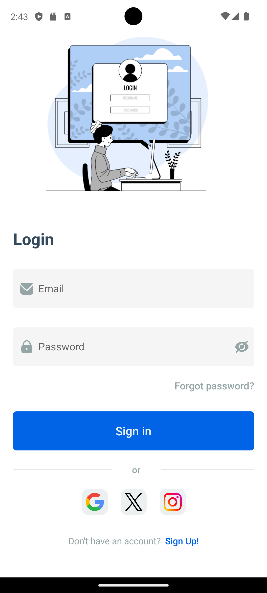
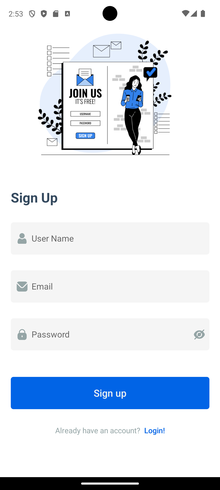
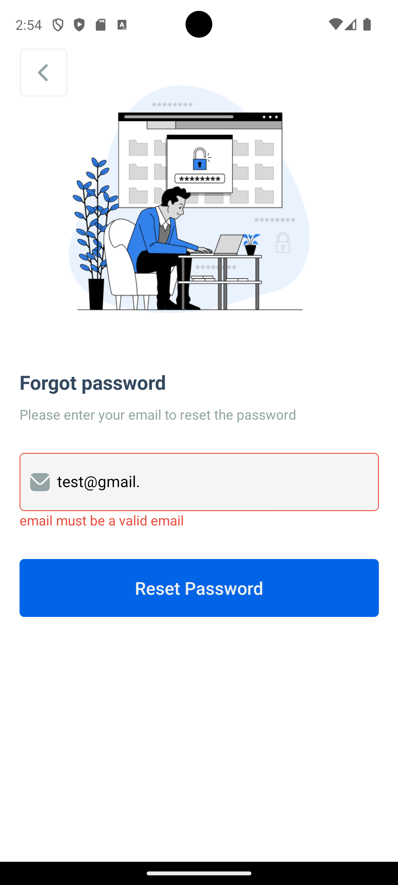
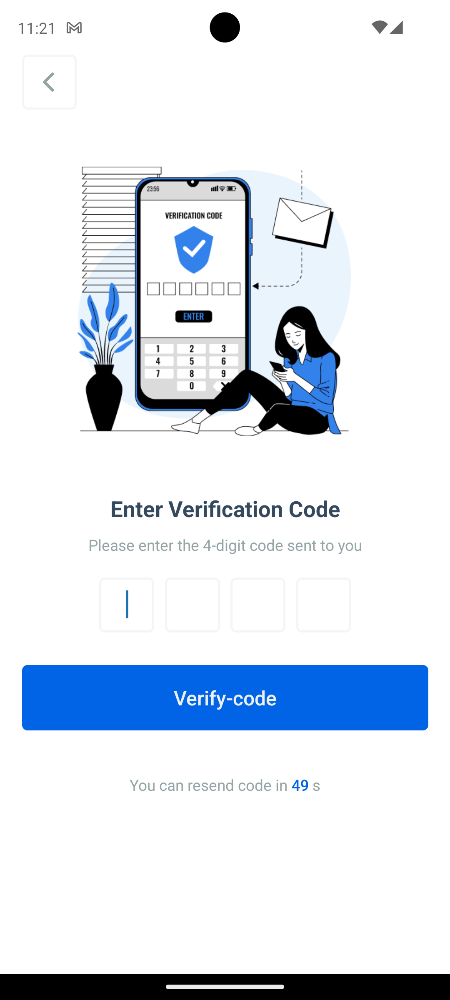

# 🔐 Password Recovery App

A **Password Recovery Application** built with **React Native** for the frontend and **Node.js + MySQL** for the backend.  
The app provides a complete flow for account management: login, registration, and password reset via email using **Nodemailer**.

## 📱 Screens
1. **Splash Screen** – Intro screen when opening the app.
2. **Login** – User login screen.
3. **Register** – Create a new account.
4. **Forgot Password** – Enter email to recover password.
5. **Verification Code** – Enter verification code sent via email.
6. **Reset Password** – Set a new password.

## 🛠️ Tech Stack

### Frontend (React Native)
- ⚛️ React Native
- 🌐 Axios (API calls)
- 🎨 Clean and user-friendly UI

### Backend (Node.js + Express)
- 🚀 Express.js
- 📬 Nodemailer (send recovery codes via email)
- 🗄️ MySQL (user data storage)

## ⚙️ How to Run

### 1️⃣ Backend (Node.js + Express)

# Navigate to backend folder
cd Server

# Install dependencies
npm install

# connect database

# Start the server
npm start

# Navigate to frontend folder
cd Client

# Install dependencies
npm install

# Start the app (Expo)
npm start

![]

